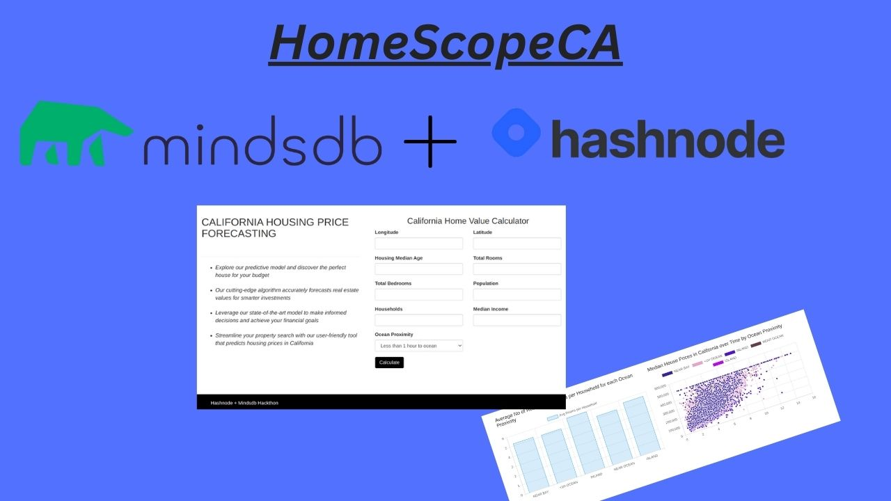

# HomeScope

HomeScope is an open-source web application built with MindsDB AI and Node.js, designed to predict and forecast house prices. It leverages a machine-learning model trained on historical housing data to deliver accurate predictions.

As a robust tool for property buyers and sellers, HomeScope offers insightful forecasts that can aid in making informed real estate decisions.


### Screenshot


## Tech Stack

 - HTML, Bootstrap 3, Chart.js , EJS template engine, MindsDB JavaScript SDK (Frontend).
 - Express, Node.js (Backend).
 - MindsDB (Machine Learning, AI Tables)
 - Linode Cloud (For Hosting Mindsdb docker image, Node.js on linode VM) 


## System requirements

 - 4 core cpu Intel or Amd.
 - 6 gb ram.
 - 30 gb hard disk.
 - Installed latest Docker Engine.
 - Installed latest Node.js & Npm.
 - Ubuntu (Recommend) or Mac os or Windows.
 - 4 gb data to download mindsdb docker image.

## Project Flow

 - A user looking to predict house prices can visit the homepage of the site.
 - In the form the user have to enter the values required to predict the house price.
 - After submiting form the request is sent to mindsdb server by node.js server to predict the house price for the given input.
 - The node.js server get the response from the mindsdb server with the data. 
 - In the result page the value of the house price, Ocean proximity along with the median values by Ocean Proximity is displayed. 
 - The user can view the average no of rooms, median price over time in the Bar chart & Scatter Plot by clicking the dashboard page on the upper right of the home page.
 
## Installation

Steps to run app on localhost

Step 1] Clone the project from github:   
```bash
  git clone https://github.com/nodeexcel/HomeScope.git
```
Step 2] Install the dependencies:
```bash
  npm install
```
Step 3] Install the latest version of MindsDB Docker Image (Docker Engine must installed on your local machine):
```bash
  docker pull mindsdb/mindsdb
  sudo systemctl start docker
```

Step 4] Go to http://localhost:47334 & select the option to upload the data through files (.csv).

Step 5] Import the housing.csv & give home_table as the name of the table in the datasource name field.

Step 6] After you press save , it will import data to files database and it had created home_table in the files. 

Step 7] Once table is created , you have to create & train the model with the data.
   #### Train the Model:
```bash
CREATE MODEL
mindsdb.home_model
FROM files
(SELECT * FROM home_table)
PREDICT median_house_value;
```
#### Predict the model:
```bash
SELECT median_house_value
FROM home_model
WHERE longitude='-122.23' AND
latitude=37.88 AND
housing_median_age=41 AND
total_rooms=880 AND
total_bedrooms=129 AND
population=322 AND
households=126 AND
median_income=8.3252 AND
ocean_proximity='NEAR BAY'
```
Step 8] Now you can write the query & predit the value in the mindsdb editor.

Step 9] Start the node.js server on your machine:
```bash
node app.js 
```


## FAQ

#### Can I use MindsDB Cloud in this project?

Yes, you can use MindsDB cloud by registering the account on mindsdb by visiting https://cloud.mindsdb.com and by adding api key to project by changing some code. 

#### Which dataset you used in the project?

I had used Housing Prices dataset from kaggle which contains more than 20000 thousand rows. It was 1990 data set.  

#### How long does it take to train the dataset?

I had used linode cloud hosting virtual machine running on ubuntu 22, 8gb ram, 4 core cpu took 35 - 40 minutes to create & train the model.